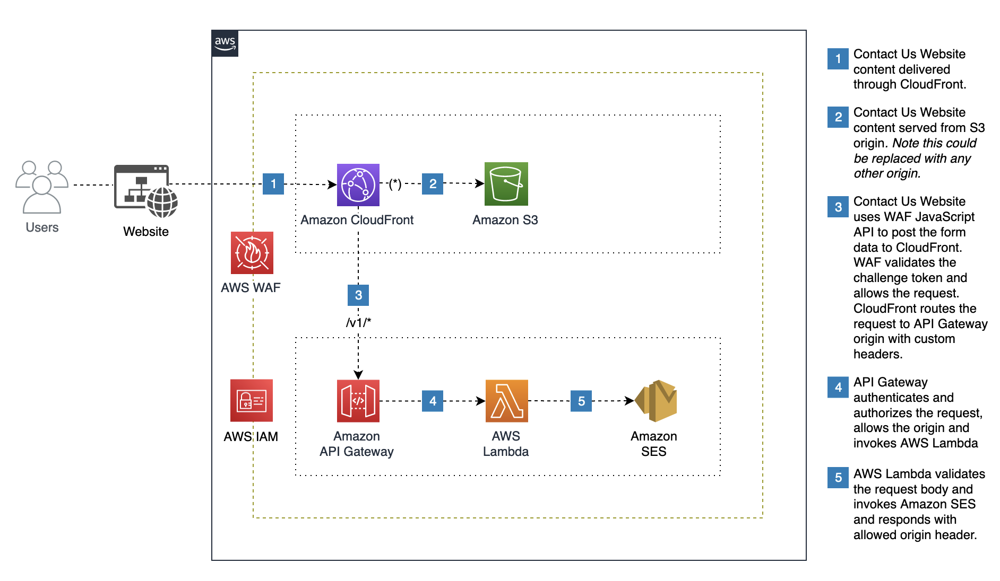

# aws-contactus-serverless-website

Leverage AWS Services Amazon CloudFront, AWS WAF, Amazon S3, Amazon API Gateway, AWS Lambda, Amazon SES to build and deploy a Contact Us serverless Website. Static Website content hosted on Amazon S3 and the REST API is deployed on Amazon API Gateway integrated with AWS Lambda and Amazon SES. Website content is served through Amazon CloudFront and protected through AWS WAF and AWS WAF CAPTCHA.

## Goal
Setup, build, test and deploy serverless Contact Us website leveraging AWS serverless services using AWS Serverless Application Model framework.

## Architecture



## Prerequisites
- [Configure an AWS Profile](https://docs.aws.amazon.com/cli/latest/userguide/cli-chap-configure.html) with right permissions to interact with your AWS Account and deploy this application. For testing you can configure the user with Administrative privileges. We do recommend to limit the permissions based on your security requirements and access controls.
- Application leverages [Amazon SES](https://aws.amazon.com/ses/) to send the outbound email. Please ensure that you have [verified email](https://docs.aws.amazon.com/ses/latest/dg/creating-identities.html#just-verify-email-proc) for SES preferrably in the same region where you plan to deploy this application.


## Build, test and deploy the application
1. Leverage [AWS Serverless Application Model](https://aws.amazon.com/serverless/sam/) to build the serverless application. To build your application for the first time, run the following in your shell after you have cloned the repository:

    ```bash
    npm install
    sam build
    ```

2. Unit tests. Tests are defined in the `__tests__` folder in this project. Use `npm` to install the [Jest test framework](https://jestjs.io/) and run unit tests for the Lambda code.

    ```bash
    npm run test
    ```

3. Deployment. To build and deploy your application for the first time, run the following in your shell:

    ```bash
    sam build
    sam deploy --guided
    ```

## Post Deployment Setup
1. Navigate to the [Amazon API Gateway Console](https://us-east-2.console.aws.amazon.com/apigateway/home?region=us-east-2) and note the API Key associated to the Contact Us API.
2. Navigate to the [Amazon CloudFront Console](https://us-east-1.console.aws.amazon.com/cloudfront/v3/home?region=us-east-2) and identify the CloudFront distribution. Navigate to the origins tab and select the API Gateway Origin and click Edit. Update the **x-api-key** custom header value with the API Key.
3. Navigate to the [Amazon Secrets Manager Console](https://us-east-1.console.aws.amazon.com/secretsmanager/listsecrets?region=us-east-2) and retrieve the secret value from the ContactUsXOriginVerifyHeaderSecret secret generated. Navigate to the CloudFront origins tab and select the API Gateway Origin and click Edit. Update the **x-origin-verify** custom header value with the value from the secrets manager.
4. Navigate to the [AWS WAF Console](https://us-east-1.console.aws.amazon.com/wafv2/home?region=us-east-2) and click on Application Integration. Navigate to the CAPTCHA Integration and click on Generate an API Key. Please provide the CloudFront Domain name and click on Generate API Key. Note the generated API Key and the JavaScript tag that will be used to update the code in [index.html](assets/html/index.html)
5. Update the **index.html** and replace **INSERT AWS WAF JAVASCRIPT TAG CODE BELOW** with the JavaScript tag and replace **REPLACE WITH CAPTCHA INTEGRATION API KEY HERE** with the CAPTCHA API Key.
6. Upload the updated **index.html** to the S3 Bucket that was created as part of the stack.

## Testing and Validation
1. Open a browser and enter the CloudFront Distribution domain name and you should see the contact us page with the CAPTCHA and the Contact Us form.
2. Complete the CAPTCHA challenge and fill in the form details and click submit and verify that you have recieved the email.

## Monthly Cost
**Assumption** 100 contact us requests per day, total of 3000 transactional requests per month.
|AWS Service | Cost | 
|--------------------------|---|
|Amazon S3 |  [Free](https://aws.amazon.com/free/) |
|Amazon CloudFront |  [Free](https://aws.amazon.com/free/) | 
|Amazon API Gateway | [Free](https://aws.amazon.com/api-gateway/pricing/) | 
|AWS Lambda |  [Free](https://aws.amazon.com/free/) | 
|Amazon SES | [$0.30](https://aws.amazon.com/ses/pricing/)  | 
|AWS WAF | [$7.06](https://aws.amazon.com/waf/pricing/) | 
|**Total** | **$7.36** | 


## Security
- Amazon CloudFront provides protection at the Edge for the website. CloudFront is enabled for geoblocking and also enforces encrypted end-to-end connections. CloudFront restricts access to the content on Amazon S3 using Origin Access Control and also prevents requests from accessing API directly using API origin. CloudFront enables custom headers for API Key and X-Origin-Verify header that is propagated with the request to the origin.
- AWS WAF provides protection from common web application exploits using AWS managed rulesets and custom rules. WAF also includes monitoring, blocking, rate-limiting and geoblocking capabilities. AWS WAF helps with blocking unwanted bot traffic using CAPTCHA and challenge actions using request parameters and configurations including Immunity Time.
- Amazon API Gateway provides traffic management, CORS support, authorization and access control including throttling, monitoring and version management. API is protected using API Key and a Custom Lambda Authorizer to validate the X-Origin-Verify header to allow the requests from only CloudFront.
- AWS Lambda is integrated with API Gateway and is enabled for CORS support.

## Security Considerations
- Code sample is provided for demonstration only. You are responsible for testing, securing, and optimizing the AWS Content, such as sample code, as appropriate for production grade use based on your specific quality control practices and standards and customize it based on your application and security requirements.
- Recommend to implement custom SSL certificate (e.g.contactus.example.com) and enforce TLS 1.2 on CloudFront security policy.
- Recommend to implement controls based on security and access requirements.

## Cleanup
```bash
sam delete
```

## Reference:
- [AWS SAM Workshop](https://catalog.workshops.aws/complete-aws-sam/en-US)
- [AWS SAM CI/CD](https://catalog.workshops.aws/complete-aws-sam/en-US/module-4-cicd/module-4-cicd-codepipeline)
- [CAPTCHA and Challenge actions in AWS WAF](https://docs.aws.amazon.com/waf/latest/developerguide/waf-captcha-and-challenge.html)
- [AWS WAF JavaScript integrations](https://docs.aws.amazon.com/waf/latest/developerguide/waf-javascript-api.html)

## Security

See [CONTRIBUTING](CONTRIBUTING.md#security-issue-notifications) for more information.

## License

This library is licensed under the MIT-0 License. See the LICENSE file.